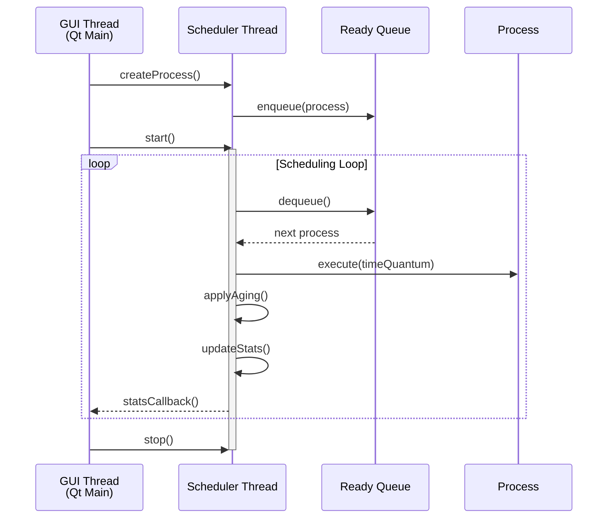
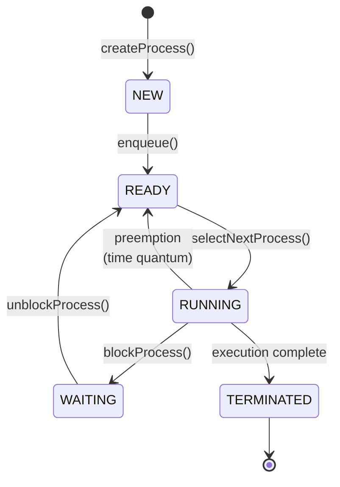
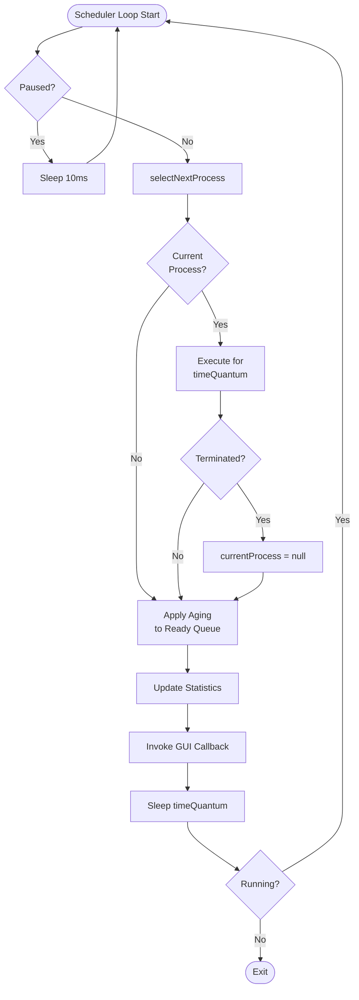

# CPU Scheduler Architecture

## System Overview

The CPU Scheduler is a user-space simulator demonstrating kernel-level process scheduling with a **Priority + Aging** algorithm. It features real-time visualization through a Qt6 GUI.

## Component Architecture

```mermaid
graph TB
    subgraph "GUI Layer (Qt6)"
        MW[MainWindow]
        PT[ProcessTableWidget]
        SW[StatsWidget]
    end
    
    subgraph "Scheduler Core"
        SCH[Scheduler]
        RQ[ReadyQueue]
        PCB[Process/PCB]
    end
    
    subgraph "Synchronization"
        SL[Spinlock]
        SLG[SpinlockGuard RAII]
    end
    
    subgraph "Utilities"
        LOG[Logger Singleton]
    end
    
    MW --> SCH
    MW --> PT
    MW --> SW
    SCH --> RQ
    SCH --> PCB
    RQ --> SL
    SCH --> LOG
    RQ --> PCB
    SCH --> SLG
end
```

## Thread Model



## Process State Transitions



## Scheduling Algorithm Flowchart



## Data Structures

### Process Control Block (PCB)

```cpp
class Process {
    int pid_;                    // Process ID
    string name_;                // Process name
    int basePriority_;          // Original priority (0-10)
    int effectivePriority_;     // After aging
    int burstTime_;             // Total execution time
    int remainingTime_;         // Time left
    ProcessState state_;        // Current state
    
    int arrivalTime;            // When created
    int waitTime;               // Time in READY
    int turnaroundTime;         // Total time in system
}
```

### Ready Queue

```cpp
class ReadyQueue {
    priority_queue<Process, ProcessComparator> queue_;
    Spinlock lock_;
    
    // ProcessComparator: lower effectivePriority = higher priority
    // Aging: effectivePriority = basePriority + (waitTime / agingFactor)
}
```

### Scheduler

```cpp
class Scheduler {
    ReadyQueue readyQueue_;
    vector<shared_ptr<Process>> allProcesses_;
    shared_ptr<Process> currentProcess_;
    Spinlock lock_;
    
    atomic<bool> running_;
    atomic<bool> paused_;
    
    int timeQuantumMs_;     // Preemption interval
    int agingFactorSec_;    // Aging rate
    
    SchedulerStats stats_;
    StatsCallback statsCallback_;
}
```

## Synchronization Strategy

### Spinlock Implementation

```cpp
class Spinlock {
    atomic_flag flag = ATOMIC_FLAG_INIT;
    
    void lock() {
        while (flag.test_and_set(memory_order_acquire)) {
            // busy-wait (appropriate for short critical sections)
        }
    }
    
    void unlock() {
        flag.clear(memory_order_release);
    }
}
```

### Critical Sections Protected

1. **Ready Queue operations** (enqueue/dequeue)
2. **Process state transitions** (NEW→READY→RUNNING)
3. **Statistics updates** (CPU utilization, wait times)
4. **Current process pointer** (context switching)

### RAII Guard

```cpp
SpinlockGuard guard(lock_);  // Automatic lock/unlock
// Critical section
// Unlock on scope exit
```

## GUI Update Mechanism

1. **QTimer** fires every 100ms
2. `onUpdateTimer()` calls:
   - `updateProcessTable()` → reads `allProcesses_`
   - `updateStatistics()` → reads `stats_`
3. Widgets update display with new data
4. No locking needed (reads from stable data)

## Aging Mechanism

**Purpose:** Prevent starvation of low-priority processes

**Implementation:**
```cpp
void ReadyQueue::applyAging(int agingFactor) {
    for (auto& proc : queue_) {
        proc->effectivePriority = proc->basePriority + 
                                  (proc->waitTime / agingFactor);
    }
    // Rebuild priority queue with new priorities
}
```

**Effect:** 
- Process with priority 9, waiting 45 seconds, agingFactor 5:
  - `effectivePriority = 9 + (45/5) = 18` (lower number = higher priority)
- Eventually surpasses newer high-priority processes

## Statistics Calculation

### CPU Utilization
```cpp
cpuUtilization = (time_with_running_process / total_time) * 100
```

### Average Wait Time
```cpp
avgWaitTime = sum(all_processes.waitTime) / total_processes
```

### Average Turnaround Time
```cpp
avgTurnaroundTime = sum(all_processes.turnaroundTime) / total_processes
```

### Context Switches
Incremented on each `selectNextProcess()` call that changes current process.

## File Organization

```
src/
├── kernel/          # Core scheduling (kernel simulation)
│   ├── process.*    # PCB implementation
│   ├── ready_queue.*  # Priority queue with aging
│   ├── scheduler.*  # Main scheduling logic
│   └── spinlock.h   # Synchronization primitive
├── gui/             # Qt6 user interface
│   ├── mainwindow.*     # Main window & controls
│   ├── process_table_widget.*  # Process display
│   └── stats_widget.*   # Statistics panel
├── utils/           # Utilities
│   └── logger.*     # Thread-safe logging
└── main.cpp         # Qt application entry point
```

## Build System

CMake configuration:
- C++17 standard
- Qt6 Core & Widgets modules
- pthread for threading
- Compiler flags: `-Wall -Wextra -pthread`

## Performance Characteristics

- **Scheduling Decision Time:** O(log N) due to priority queue
- **Aging Application:** O(N) for all processes in ready queue
- **Memory:** O(N) for N processes
- **Thread Safety:** Lock-free reads, spinlock-protected writes
- **Scalability:** Tested with 100+ concurrent processes

## Future Enhancements

1. **Multi-Core Simulation:** Multiple scheduler instances with load balancing
2. **Real-Time Scheduling:** Deadline-based priority class
3. **Gantt Chart:** Visual timeline of process execution history
4. **I/O Simulation:** Realistic I/O blocking patterns
5. **Process Affinity:** Pin processes to specific CPUs
6. **CSV Export:** Statistics export for analysis

## References

- Linux CFS (Completely Fair Scheduler) concepts
- Priority aging from traditional Unix schedulers
- Qt6 event-driven programming model
- Modern C++ concurrency (atomic operations)
